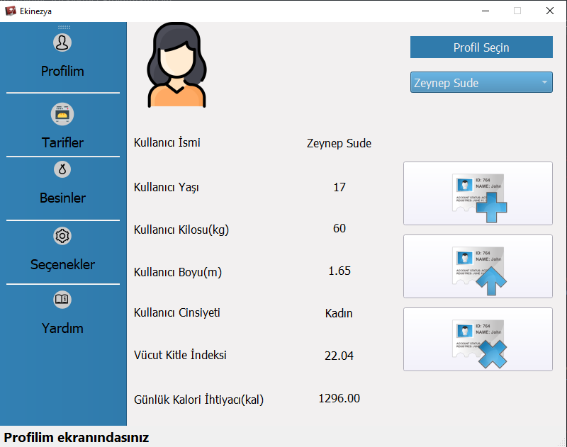
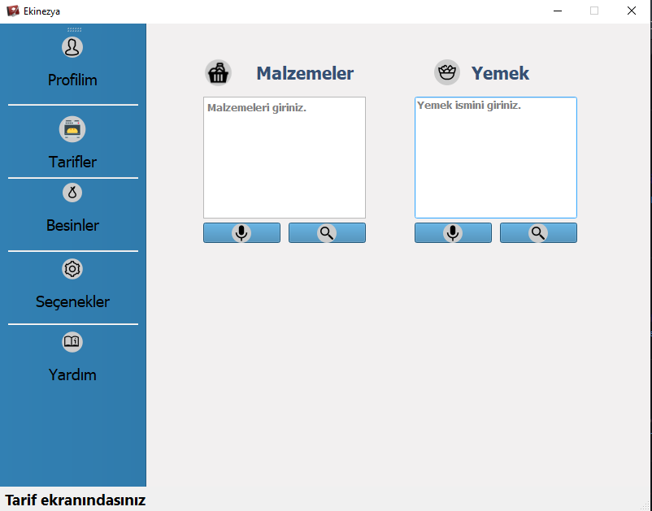
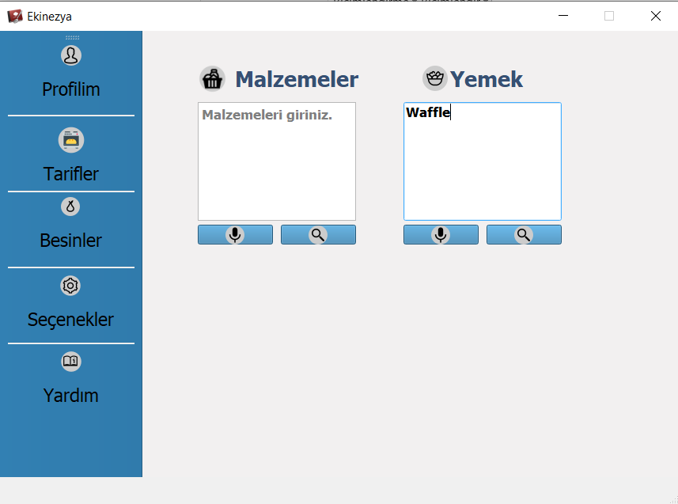
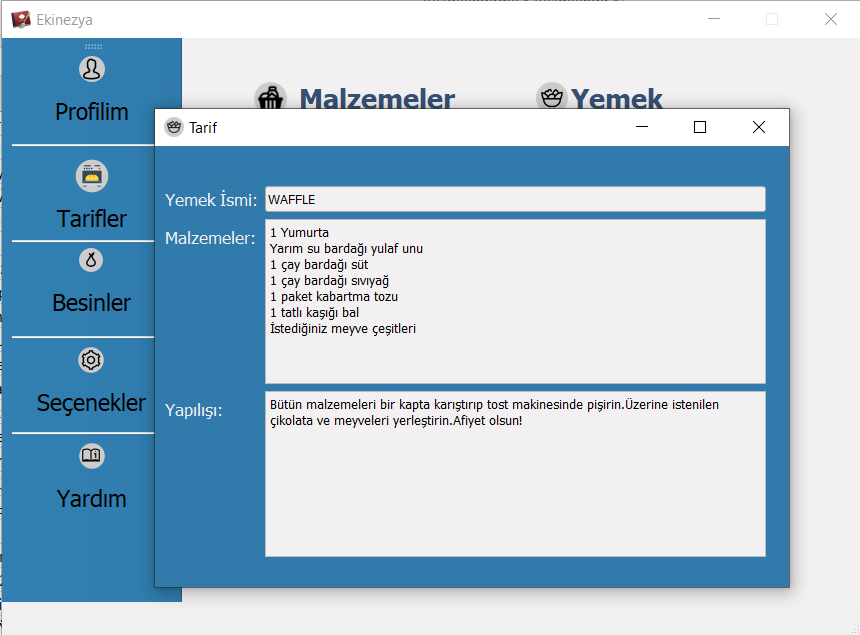
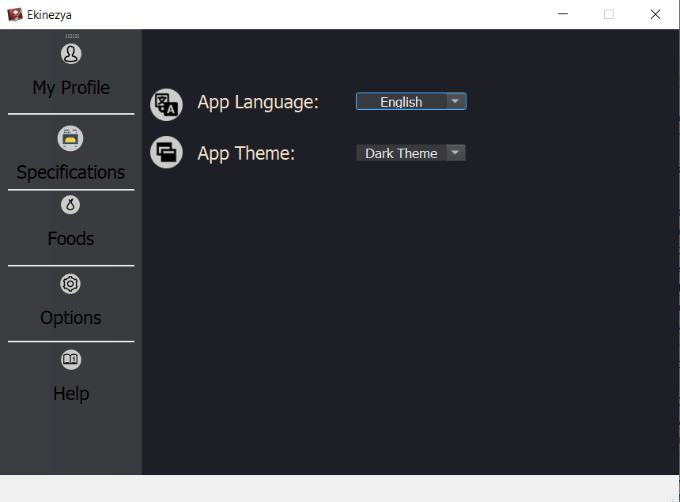
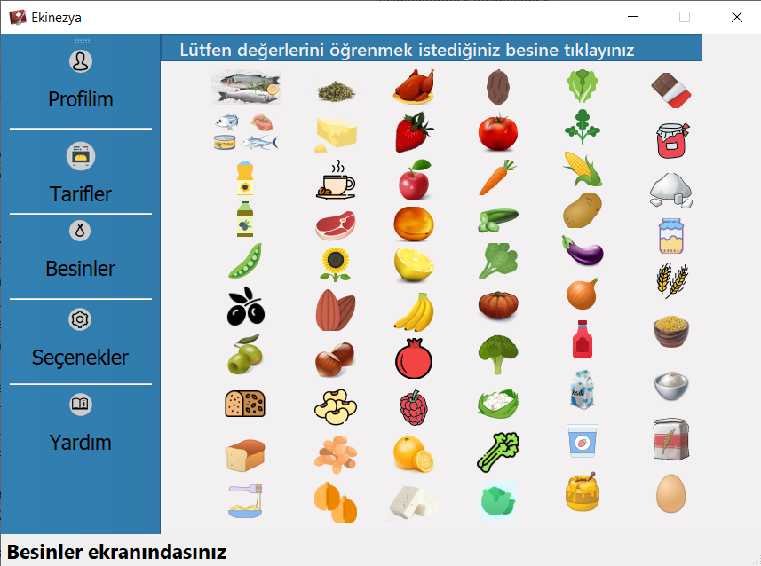

# Ekinezya nedir?
Sağlıklı besin ve tarif öneren masaüstü uygulaması

# Ekinezya ne yapar?
- Girilen malzemeleri değerlendirip sağlıklı alternatiflerini önerir.
- Girilen yemek ismine göre sağlıklı tarifini önerir.
- Besin değerlerini gösterir.
- Günlük kalori ihtiyacını ve vücut kitle indeksini hesaplar.

## Özet
Sağlık, insan yaşamının sürdürülmesi sırasında yaşam kalitesinin yükseltilmesi ve korunması için önemlidir. Sağlığın korunması kişinin öncelikle kendi sağlığına sahip çıkması ve sağlık bilincini geliştirmesi ile mümkündür. Bu hususta yeterli ve dengeli beslenme sağlığın temelidir. Sağlıklı bir yaşamı hedefleyen ve bunu yediği besinler ile hayatına uygulamak isteyen bireylerin kendi özelliklerini baz alarak onlara uygun günlük kalori ihtiyacının hesaplanması ve kullanıcılara gerek arattıkları yemek ismine göre sağlıklı tarifi, gerekse girdikleri tarife göre sağlıklı besin önerilerini gösteren bir masaüstü uygulaması yapılması hedeflenmiştir. Bu amaç doğrultusunda bir masaüstü programı yapılmıştır.

## Uygulamamızı bilgisayarınızda çalıştırın
```bash
git clone https://github.com/YildirimCat/Ekinezya.git
```
Kolaylık olması açısından tüm projeyi Pycharm vb. IDE'leri kullanarak açabilirsiniz.

## Gereksinimler
- PyQt5
- speechRecognition
- pandas
- csv

## Özellikler
- Yeni profil oluşturma,profil güncelleme ve silme
- Açık/Koyu mod geçişi
- Kısmi Türkçe/İngilizce çeviri
 
## Öneri
Yeni kullanıcılara uygulamayı kullanmadan önce uygulamanın 'Yardım' sayfasına göz atmasını tavsiye ederiz.

## To-Do's
- Statusbar mesajları 
- Speech-to-text sorunu

## Ekran Görüntüleri






